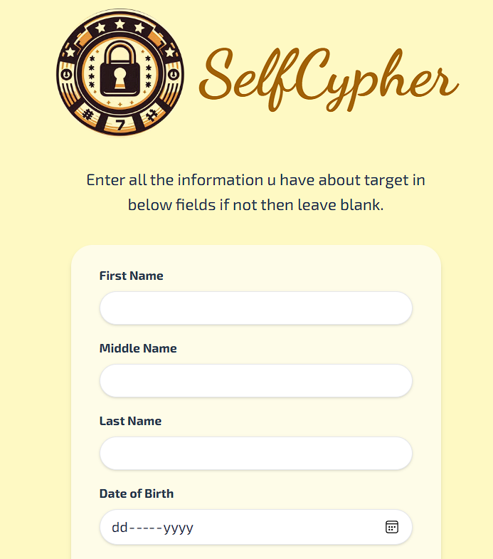
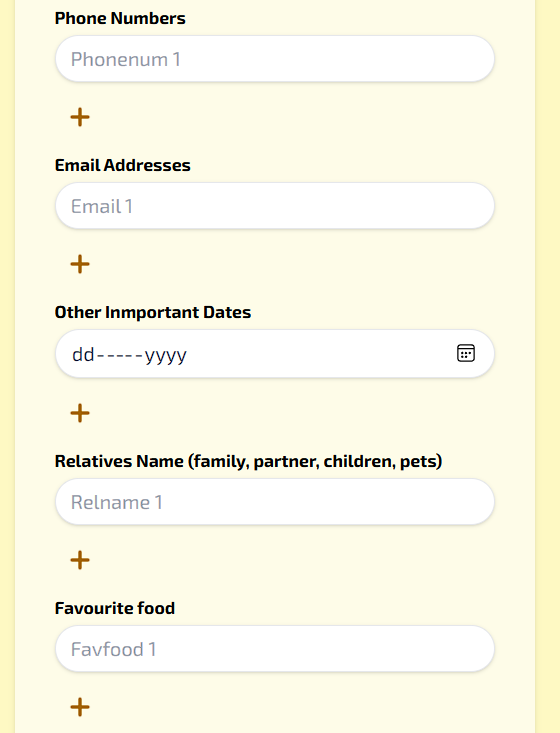
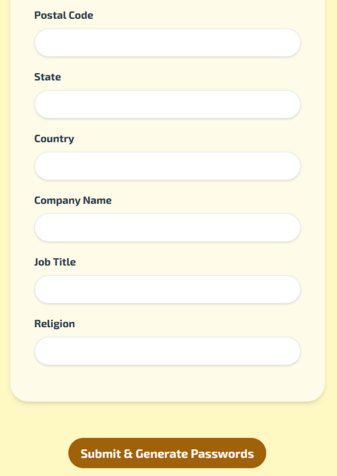

# SelfCypher

SelfCypher is a personalized password list generator designed for cybersecurity awareness, and educational purposes. It generates a list of potential passwords based on user-provided information, demonstrating how personal data can be used to create password guesses.

{:height="300px" :width="300px"}

## Features

- Web-based user interface for easy input of personal information
- Generates a comprehensive list of potential passwords based on user data
- Demonstrates the importance of using strong, unique passwords
- Educational tool for understanding password security principles

## Technologies Used

- Python
- Flask
- Tailwind CSS
- JavaScript

## Installation

1. clone the repository
2. Go inside the project directory.
3. Install python dependencies and node packages.
4. Build CSS by using 'npm run build-css' and keep that running in terminal.
## Usage

1. Start the Flask server:
python selfcypher.py
Copy
2. Open a web browser and navigate to `http://localhost:5000` or the url shown in terminal.

3. Fill in the form with the target information

4. Click "Submit & Generate Passwords" to create the password list

5. Downloading will start (may take some time in some cases).

## Screenshots

## Disclaimer

SelfCypher is intended for educational purposes only. It should not be used for unauthorized access to accounts or systems. Always respect privacy and adhere to applicable laws and regulations.

## Contributing

Contributions to improve SelfCypher are welcome. Please feel free to submit pull requests or open issues to suggest improvements or report bugs.

## Contact

For any questions or concerns, please email keshavanandverma03@gmail.com.

